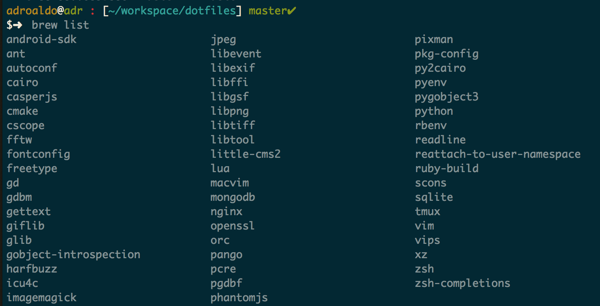

# Configurations Files

This are basic setup for system files and other useful programs that help on development enviroment.

## Backup First

1. Make a data backup
2. Sign out iTunes (`Store > Deauthorize This Computer`. [Deauthorizing your computer using iTunes](https://support.apple.com/en-us/HT204385))
3. Sign out iCloud ([Archive or make copies of your iCloud data](https://support.apple.com/en-us/HT204055))
4. Sign out iMessage (`Preferences > Accounts`. Select your iMessage account, then click Sign Out)

## System Files

1. [Git Config File](./.gitcofig)
1. [Adro ZSH Theme](./.adro.zsh-theme)
1. [Adroaldo ZSH Theme](./.adroaldo.zsh-theme.bkp)
2. [Basic VimRC File](./.vimrc.my.bkp)

## Command Line Programs

1. [Home Brew]()
    
        ruby -e "$(curl -fsSL https://raw.githubusercontent.com/Homebrew/install/master/install)"

1. android-sdk
    - Install all needed versions (It will take a while)
1. ant
1. gettext
1. mongodb
    - Intall at /var/db
1. nginx
1. pyenv
1. rbenv
1. sqliter
1. tmux
1. reattach-to-user-namespace
1. vim
1. zsh
1. zsh-completions
1. wine

## App Store Programs

1. [Clear]()
1. [Dash]()
1. [Evernote]()
1. [Kindle]()
1. [Skype]()
1. [The Unarchiver]()
1. [Universal Translator]()
1. [Xcode]()
1. [xScope]()

## Downloaded Programs

1. [Alfred](https://www.alfredapp.com/)
1. [Balsamiq Mockups 3](https://balsamiq.com/)
1. [BetterTouchTool](http://bettertouchtool.en.softonic.com/mac)
1. [Genymotion](https://www.genymotion.com/)
1. [GitX](https://rowanj.github.io/gitx/)
    - `Gitx > Enable Terminal Usage`
1. [Mou](http://25.io/mou/)
1. [MPlayerX](http://mplayerx.org/)
1. [OpenEmu](http://openemu.org/)
1. [Poedit](https://poedit.net/)
1. [Postgres](http://postgresapp.com/)
1. [Postico](https://eggerapps.at/postico/)
1. [PyCharm](https://www.jetbrains.com/pycharm/)
1. [Sublime Text](http://www.sublimetext.com/)
    - [Sublime Text Configurations](./READMES/sublime.md)
1. [TeamViewer](https://www.teamviewer.com)
1. [Transmit](https://panic.com/transmit/)
1. [VirtualBox](https://www.virtualbox.org/)
1. [Webstorm](https://www.jetbrains.com/webstorm/)
    - [Webstorm Configurations](./READMES/webstorm.md)

